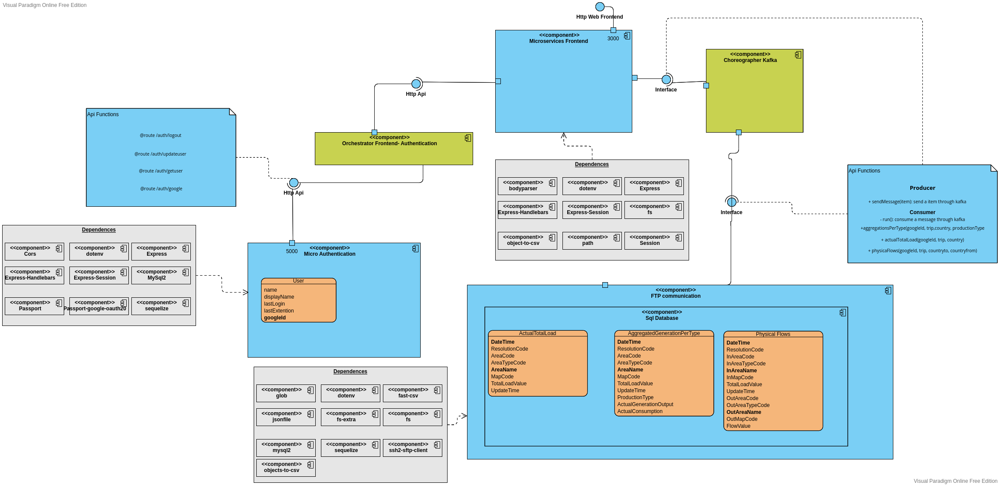

# EnergyLive2022-Ntua


### Project 
This project is based on microservice application. This has been completed as a part of
the NTUA cource of Software Service Technologies. The contributor is : 
George Pagonis AM: 03117030


Microservices: 
- Frontend microservice
- Authentication microservice
- Ftp Communication microservice

#### Prerequisites
```
npm v8.15
node v18.6.0
docker compose v2
```
#### Directory
- microftp: ftp  communication microservice
- microauth: authentication microservice
- frontend: frontend microservice
- architecture: vpd component diagram
- docs: 
  - images: application images
  - vpd: all vpd diagrams
  - vpdimages: all vpd images
  - youtrack: youtrack images (similar can be found on github project) 
#### Architecture

#### A brief introduction to architecture
We have a front end application running on 3000 port. 
The authentication app runs on 5000 port with a sql database 
to store the users. 
They communicate with http api protocol, so the authenication 
can provide services to to front end app. 

The ftp communication provides 2 functions to use kafka(src/consumer.js|producer.js): 
 - sendMessage(item) : send a item 
 - run : consume

These functions provide the nesseccery logic for the outside world to 
communicate with the databases inside the microservice. 
This microservice host the databases to store the data taken from the entsoe.com
website. 

The functionality is that the front end sends the nesseccery item to ftp microservice. 
The microservice communicates with the ftp server. Loads the data to the database, prerform
a query and return the result. 

Further, the front end illustates that result in a highchart table. 


The following component diagram depicts the architecture. 

##Installation
Due to the microservice architecture every component is indepentent from each other. 
We have make use of docker containers. This contain the sql databases, the zookeeper 
and the kafka. 
To be able to replicate the code follow each step on each directory. 

### microauth
```
 docker compose -f sql.yml up -d
 npm start
```

### microfrontend
```
 npm start
 // Change path in routes/index.js line 38
```
### micrtoftp 
```
 docker compose -f docker-compose.yml up -d
 mkdir csvtest
 npm start
 
```
#### Problems with docker 
- If kafka has problems, delete the instances of the container with ./deletecompose.sh
and start it again normally. 

- Don't start the apps to early, they databases may not have been finished their setup.

##### Every directory of the microservices explains the api to use them. 

### TODO
- Add jMeter tests
- Fix repeating application

